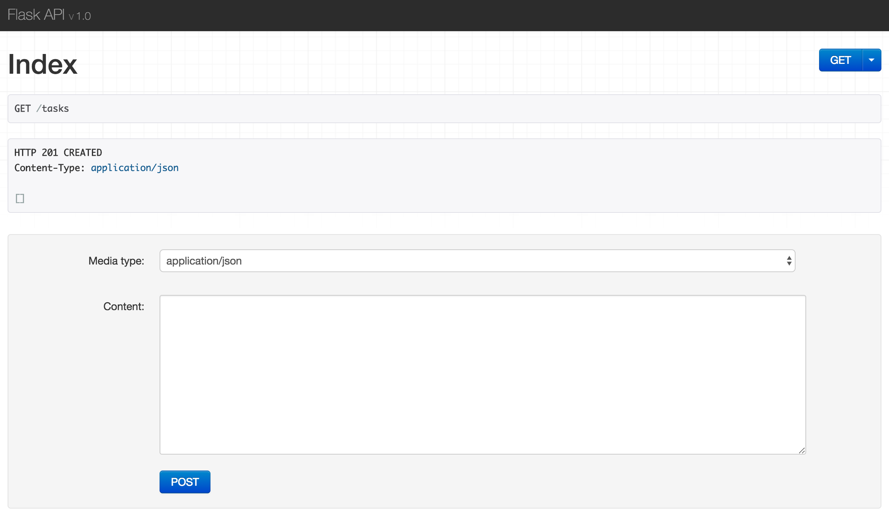
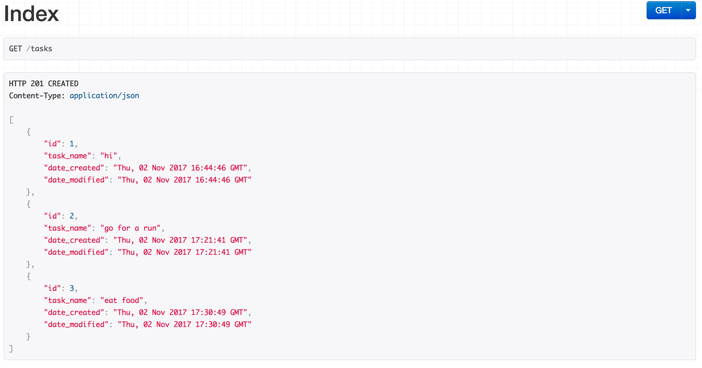
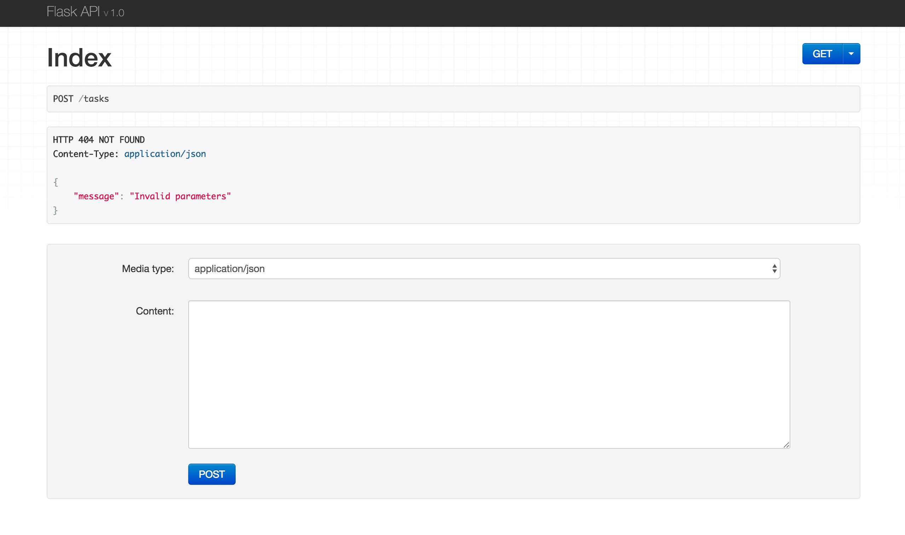
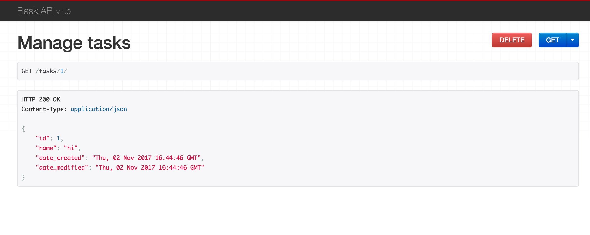
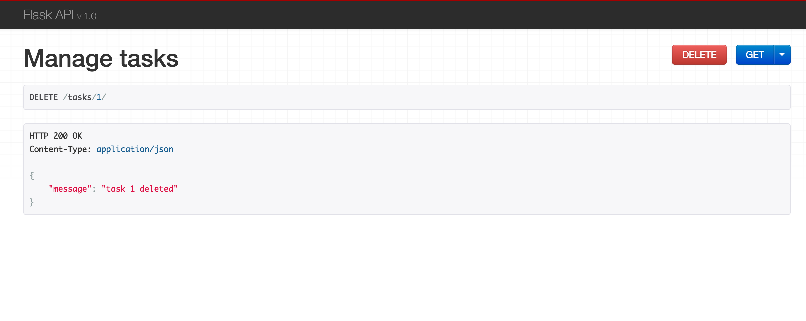
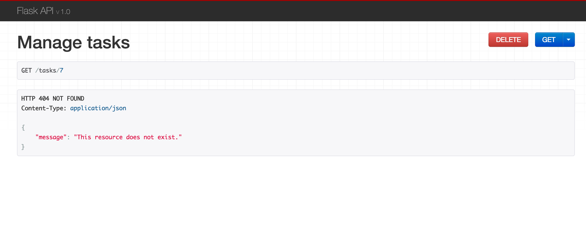

# Handling Exceptions in Flask

This tutorial will teach you how to handle exceptions in Flask. We will build a simple RESTful Flask API and create custom exceptions for our code.

Dependencies:

- Python v3.6.2
- Flask v0.12.2
- Flask-SQLAlchemy v2.3.2
- Flask API v1.0

## Objectives

By the end of this tutorial, you will be able to:

1. Define Python exceptions
1. Understand the Flask API framework
1. Create custom exceptions for your code
1. Use Python exceptions in Flask

## What is a Python Exception?

A python exception is an error that occurs when executing a program, causing the program to stop. If you think that your program might raise an exception when executed, you might find it useful to use exceptions to handle the errors.

TODO what do you mean by "raise"? Someone may be just reading about exceptions for the first time. Don't assume they know what "raise" means.
TODO add simple example of handling an exception

## Flask API Example

To speed up development, we'll use [Flask API](http://www.flaskapi.org/), which is an implementation of the same web browsable APIs that [Django REST framework](http://www.django-rest-framework.org/) provides. It'll help us implement our own browsable API.

We will develop an API for Tasks, where users will be able to:

- Create new tasks
- View all tasks
- Delete existing tasks

## Project Setup

Create a new project called "task-exceptions":

```sh
$ mkdir task-exceptions && cd task-exceptions
$ python3.6 -m venv env
$ source env/bin/activate
(env)$
```

Install the necessary dependencies:

```sh
(env)$ pip install flask==0.12.2
(env)$ pip install flask-sqlalchemy==2.3.2
(env)$ pip install flask-api==1.0
(env)$ pip freeze > requirements.txt
```

Create the following files and folders:

```sh
├── app
│   ├── __init__.py
│   ├── errors.py
│   └── models.py
├── requirements.txt
└── run.py
```

Be sure to add a *.gitignore* to the project root if you're using git:

```
__pycache__
env
```

### Database Configurations

Along with SQLite, we'll use [Flask-SQLAlchemy](http://flask-sqlalchemy.pocoo.org) to manage  [SQLAlchemy](https://www.sqlalchemy.org/). Define the following database configurations in *app/\_\_init\_\_.py*:

```python
from flask_sqlalchemy import SQLAlchemy
from flask_api import FlaskAPI


app = FlaskAPI(__name__)
app.config['SQLALCHEMY_DATABASE_URI'] = 'sqlite:///tasks.db'
app.config['SQLALCHEMY_TRACK_MODIFICATIONS'] = False
db = SQLAlchemy(app)
```

### Database Model

Add the task model to the *models.py* file:

```python
import datetime

from sqlalchemy import String, Integer, DateTime

from app import db


class Task(db.Model):
    id = db.Column(db.Integer, primary_key=True)
    task_name = db.Column(db.String(80), unique=True)
    date_created = db.Column(db.DateTime, default=datetime.datetime.utcnow)
    date_modified = db.Column(db.DateTime, default=datetime.datetime.utcnow)

    def __init__(self, task_name):
        self.task_name = task_name

    def __repr__(self):
        return f'<Task {self.task_name}>'
```

### Run

Now, let's define an entry point to start our app. Inside *run.py*, add the following code:

```python
from flask import jsonify, request
from flask_api import status, exceptions

from app import app, db
from app.models import Task


if __name__ == '__main__':
    db.create_all()
    app.run(debug=True)
```

What's happening?

1. `db.create.all()` creates the database tables when we run the app
1. `debug = true ` enables Flask [debug mode](http://flask.pocoo.org/docs/0.12/quickstart/#debug-mode), which is important for debugging while you're developing your app app. Do not use this in production.

### Sanity Check

Back in the terminal, run:

```sh
(env)$ python run.py
```

You should see something similar to:

```sh
* Running on http://127.0.0.1:5000/ (Press CTRL+C to quit)
* Restarting with stat
* Debugger is active!
* Debugger PIN: 295-423-238
```

Also, the database - *tasks.db* - should have been created in the "app" directory. To view, first kill the Flask server, and then run:

```sh
(env)$ sqlite3 app/tasks.db

sqlite> .schema
CREATE TABLE task (
	id INTEGER NOT NULL,
	task_name VARCHAR(80),
	date_created DATETIME,
	date_modified DATETIME,
	PRIMARY KEY (id),
	UNIQUE (task_name)
);
sqlite>
```

Now that we are done with the basic setup, the next step is to create our views, which we'll separate into two views:

1. all tasks
1. single task

## View - all tasks

As mentioned in the beginning of the tutorial, we want to be able to add, delete, and show all our tasks. Let's define our first view and see how to handle basic exceptions.

In the *run.py*, add the following view:

```python
@app.route('/tasks', methods=['GET', 'POST'])
def index():
    if request.method == 'GET':
        tasks = Task.query.all()
        results = []
        for task in tasks:
            res = {
                'id': task.id,
                'task_name': task.task_name,
                'date_created': task.date_created,
                'date_modified': task.date_modified
            }
            results.append(res)
        return results, status.HTTP_201_CREATED
    elif request.method == 'POST':
        task_name = request.data['task_name']
        if task_name:
            new_task = Task(task_name=task_name)
            db.session.add(new_task)
            db.session.commit()
            response = {
                'id': new_task.id,
                'task_name': new_task.task_name,
                'date_created': new_task.date_created,
                'date_modified': new_task.date_modified
            }
            return response, status.HTTP_201_CREATED
```

TODO refactor for loops to list comps

Add the following imports as well:

1. `from flask import request`
1. `from flask_api import FlaskAPI, status`
1. `from app.models import Task`

You should now have:

```python
from flask import request
from flask_sqlalchemy import SQLAlchemy
from flask_api import FlaskAPI, status


app = FlaskAPI(__name__)
app.config['SQLALCHEMY_DATABASE_URI'] = 'sqlite:///tasks.db'
app.config['SQLALCHEMY_TRACK_MODIFICATIONS'] = False
db = SQLAlchemy(app)

from app.models import Task

@app.route('/tasks', methods=['GET', 'POST'])
def index():
    if request.method == 'GET':
        tasks = Task.query.all()
        results = []
        for task in tasks:
            res = {
                'id': task.id,
                'task_name': task.task_name,
                'date_created': task.date_created,
                'date_modified': task.date_modified
            }
            results.append(res)
        return results, status.HTTP_201_CREATED
    elif request.method == 'POST':
        task_name = request.data['task_name']
        if task_name:
            new_task = Task(task_name=task_name)
            db.session.add(new_task)
            db.session.commit()
            response = {
                'id': new_task.id,
                'task_name': new_task.task_name,
                'date_created': new_task.date_created,
                'date_modified': new_task.date_modified
            }
            return response, status.HTTP_201_CREATED
```

Now, run the app:

```sh
(env)$ python run.py
```

Navigate to [http://localhost:5000/tasks](http://localhost:5000/tasks) in your browser of choice. You should see an empty list of tasks because we have not added any yet:



<br>

Add several tasks via the `POST` request form:


<br>

Refresh the page, and you should see a list of all the tasks:



<br>

Now, try to do a `POST` request with no data. You should see a `Bad Request` error, which you do not want your end users to see and is exactly why want to handle exceptions in your code.

## Handling Exceptions

We need to raise an exception so that the user knows what went wrong.
Let's write an exception if no data is passed in to a `POST` request.

Update *errors.py* like so:

```python
from flask_api.exceptions import APIException


class InvalidParameter(APIException):
    status_code = 404
    detail = 'Invalid parameters'
```

TODO this should not be a 404. This may be a good time to talk about throwing proper status codes.

Flask API has an [APIException](http://www.flaskapi.org/api-guide/exceptions/) class which we have inherited to create our custom Exception. Let's include the exception in our `index` view:

```python
@app.route('/tasks', methods=['GET', 'POST'])
def index():
    if request.method == 'GET':
      ...
    elif request.method == 'POST':
        if 'task_name' in request.data:
            task_name = request.data['task_name']
            if task_name:
                new_task = Task(task_name=task_name)
                db.session.add(new_task)
                db.session.commit()
                response = {
                    'id': new_task.id,
                    'task_name': new_task.task_name,
                    'date_created': new_task.date_created,
                    'date_modified': new_task.date_modified
                }
                return response, status.HTTP_201_CREATED
        raise InvalidParameter
```

Add the import:

```python
from app.errors import InvalidParameter
```

Let's do a test and see if the exception we have implemented is working. Again, try to do a `POST` request with no data. The response should look something like this:

```
HTTP 404 NOT FOUND
Content-Type: application/json

{
    "message": "Invalid parameters"
}
```



<br>

As you can see, it's now easier (and prettier) to know what went wrong by letting an exception do the explaining for us.

Now let's write the second view for deleting a task.

## View - single task

In the *\_\_init\_\_.py*, add the following view below the existing view:

```python
@app.route('/tasks/<int:id>', methods=['GET', 'DELETE'])
def manage_tasks(id):
    task = Task.query.filter_by(id=id).first()
    if request.method == 'GET':
        response = {
            'id': task.id,
            'name': task.task_name,
            'date_created': task.date_created,
            'date_modified': task.date_modified
        }
        return response
    elif request.method == 'DELETE':
        db.session.delete(task)
        db.session.commit()
        return {
            'message': f'task {task.id} deleted'
        }
```

The above view gets a task by its `id`, and then deletes it from the database if the request method is `DELETE`. Meanwhile, if the request is `GET`, it will simply display that individual task. Assuming you created a task with the `id` of `1`, navigate to [http://localhost:5000/tasks/1](http://localhost:5000/tasks/1) in your browser:



<br>

Try deleting the task:

```
HTTP 200 OK
Content-Type: application/json

{
    "message": "task 1 deleted"
}
```

Success!



<br>

## Handling More Exceptions

What if we input an `id` that doesn't exist - i.e., [http://localhost:5000/tasks/987654322](http://localhost:5000/tasks/987654322). Assuming an `id` of `987654322` doesn't exist, you should see an error:

```
AttributeError: 'NoneType' object has no attribute 'id'
```

We need to take care of this error by raising a `NotFound` exception when a task does not exist. Luckily, we don't need to create a custom exception because the [NotFound](http://www.flaskapi.org/api-guide/exceptions/) is built in to Flask API.

TODO this is also built in to Flask. This could be a perfect point to show how to use the native Flask exceptions.
TODO what if I did want to customize this exception? How would I go about doing that?

Update the view:

```python
@app.route('/tasks/<int:id>', methods=['GET', 'DELETE'])
def manage_tasks(id):
    task = Task.query.filter_by(id=id).first()
    if not task:
        raise exceptions.NotFound()
    if request.method == 'GET':
        response = {
            'id': task.id,
            'name': task.task_name,
            'date_created': task.date_created,
            'date_modified': task.date_modified
        }
        return response
    elif request.method == 'DELETE':
        db.session.delete(task)
        db.session.commit()
        return {
            'message': f'task {task.id} deleted'
        }
```

Don't forget the import:

```python
from flask_api import FlaskAPI, status, exceptions
```

So, if the task does not exist, we raise a `NotFound()` exception to handle the error. This time, when you navigate to [http://localhost:5000/tasks/987654322](http://localhost:5000/tasks/987654322), you should see the following response:

```python
HTTP 404 NOT FOUND
Content-Type: application/json

{
    "message": "This resource does not exist."
}
```



<br>
